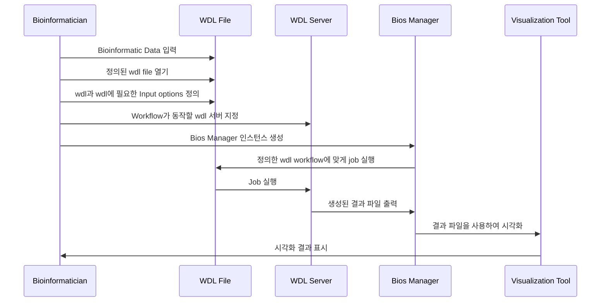

# oss-2024-bios
공개SW 개발자대회 2024 지원 프로젝트 입니다.

## Bios?
Bios는 Bio-Informatics Open-source Software의 약자로, 생물정보학 분야에서 사용되는 워크플로우를 관리하고 실행하는 엔진과 분석을 통합 관리하는 라이브러리 입니다. Bios는 사용자가 작성한 WDL(Workflow Description Language) 스크립트를 해석하고 실행하여 워크플로우를 관리합니다.

## Project Architecture
### Sequence Diagram


## Project Structure
```
Bios
├── api/                              # [TBD]
│   ├── __init__.py        
│   ├── main.py                       # FastAPI application entry point
│   ├── routes.py                     # API routes for workflow management
│   ├── models.py                     # Pydantic models for request/response schemas
├── core/                             # Core logic for workflow engine
│   ├── __init__.py        
│   ├── manager.py                    # Workflow manager for parsing and executing WDL scripts
│   ├── logic_injector.py             # Logic injector for injecting custom logic into WDL scripts
│   ├── workflow_validator.py         # Workflow validator for validating WDL scripts
│   ├── visualizer.py                 # Workflow visualizer for visualizing WDL scripts
│   ├── managers/
│   │   ├── __init__.py
│   │   ├── cromwell_manager.py       # Cromwell manager for executing WDL scripts with Cromwell
├── tests/
│   ├── __init__.py
│   ├── test_workflow_validator.py    # Unit tests for workflow validator
│   ├── test_cromwell_manager.py      # Unit tests for Cromwell manager
│   ├── data/
│   │   ├── __init__.py
│   │   ├── invalid_workflow.wdl      # Invalid WDL script for testing
│   │   ├── valid_workflow.wdl        # Valid WDL script for testing
├── wdls/  
│   ├── covid_analysis.wdl            # Example WDL script for COVID-19 data analysis
├── logics/
│   ├── __init__.py
│   ├── gc_content.py                 # Example custom logic for calculating GC content
│   ├── sequence_length.py            # Example custom logic for calculating sequence length
│   ├── Pipfile                       # Pipenv Pipfile for dependency management (for custom logic)
│   ├── Pipfile.lock                  # Pipenv Pipfile.lock for reproducible environments (for custom logic)
├── utils.py                          # Utility functions for general use
├── start_cromwell.sh                 # Script for starting Cromwell server
├── stop_cromwell.sh                  # Script for stopping Cromwell server
├── Dockerfile                        # Dockerfile for containerization
├── Pipfile                           # Pipenv Pipfile for dependency management
├── Pipfile.lock                      # Pipenv Pipfile.lock for reproducible environments
├── .env.example                      # Example .env file for environment variables
├── .gitignore                        # Git ignore file
├── LICENSE                           # Project license
├── pytest.ini                        # Pytest configuration file
└── README.md                         # Project documentation
```

## Getting Started
### Prerequisites
- Python 3.11+
- Pipenv
- Docker
- Cromwell

### Installation
1. Clone the repository
```bash
git clone
```

2. Install dependencies
```bash
pipenv install
```

3. Start Cromwell server
```bash
# Download Cromwell JAR file
# https://github.com/broadinstitute/cromwell/releases
wget -O modules/cromwell.jar https://github.com/broadinstitute/cromwell/releases/download/87/cromwell-87.jar

# Start Cromwell server
./start_cromwell.sh
```

4. Run codes
```python
from time import sleep

from core.manager import Manager
from core.managers.cromwell_manager import CromwellManager
from core.workflow_validator import validate_wdl
from utils import make_absolute_path

# prepare files
wdl_file = "wdls/covid_analysis.wdl"
output_file = "output_file.txt"

# input options
input_options = {
    "CoronavirusAnalysis.fasta_file": "data/coronavirus.fasta",
    "CoronavirusAnalysis.gc_content_script": "logics/gc_content.py",
    "CoronavirusAnalysis.sequence_length_script": "logics/sequence_length.py",
    "CoronavirusAnalysis.pipfile": "logics/Pipfile",
    "CoronavirusAnalysis.pipfile_lock": "logics/Pipfile.lock",
    "CoronavirusAnalysis.output_file": output_file,
}
options = {
    "final_workflow_outputs_dir": make_absolute_path("outputs"),
    "use_relative_output_paths": True,
}

# validate wdl
validate_wdl(wdl_file)

# initiate manager
manager = Manager(CromwellManager())
manager.authenticate()

# submit workflow
submit_result = manager.submit_workflow(wdl_file, input_options, options)
print(submit_result)

# wait for workflow to finish
result = manager.get_workflow_status(submit_result["id"])
while not result or result[0]["status"] not in ["Succeeded", "Failed"]:
    result = manager.get_workflow_status(submit_result["id"])
    print(result)
    sleep(5)
```
